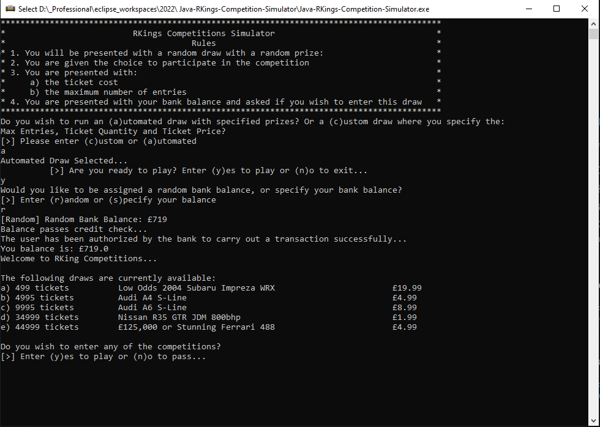
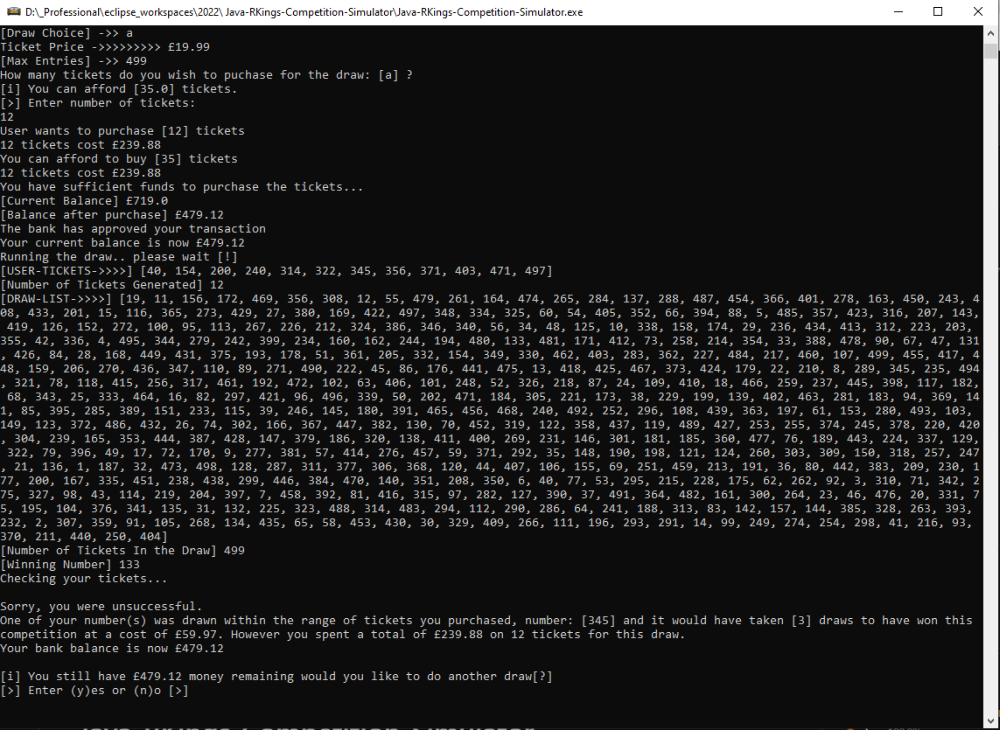

</a>

# Java RKings Competition Simulator

# Table of Contents

- [Java RKings Competition Simulator](#java-rkings-competition-simulator)
- [Table of Contents](#table-of-contents)
- [Screenshot of the Application](#screenshot-of-the-application)
- [Big-O Notation - Runtime Complexity](#big-o-notation---runtime-complexity)
- [Instructions](#instructions)
- [Package(s) used within the Application](#packages-used-within-the-application)
- [System requirements](#system-requirements)
- [Source Code](#source-code)

---

> Java RKings Competition Simulator is a console menu driven application providing the user an estimate on realistic odds of winning a draw based on random or user provided parameters with metrics.

# Screenshot of the Application

 
 

# Big-O Notation - Runtime Complexity

- Application runtime is O(n) - Linear Time

---

# Instructions

- Clone the repo and run the executable file `Java-RKings-Competition-Simulator.exe`

# Package(s) used within the Application

- java.util.Scanner;
- import java.util.ArrayList;
- import java.util.Collections;

# System requirements

- JavaSE-1.8 or higher.

# Source Code

The project was developed in Eclipse IDE and all source code and projects are uploaded as an Eclipse project for convenience.

- Source code is available to view in the src folder
- Compiled code located in the bin directory.
- Jar File
- Executable (.exe) File
